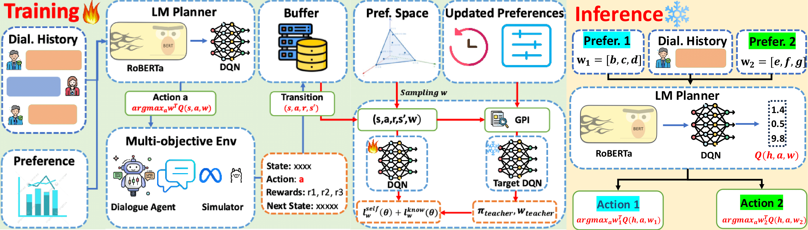

# Official Implementation of Preference Adaptive Dialogue Policy Planner (PADPP)

This repo contains the official implementation for our PADPP - a novel preference adaptive dialogue policy planner for multi-objective goal-oriented dialogues.




## Installation
First, please install required libraries by running the following command.
```console
pip install -r requirements.txt
```
## Data
We develope and evaluate PADPP on two published goal-oriented dialogues, including DuRecDial2.0 and CraigslistBargain. 

To download datasets, including DuRecDial 2.0 and CraigslistBargain, please access the following [link](https://drive.google.com/drive/folders/1geGSLEuyW2YrCbLMLdyOqaE7n5KRZN4z?usp=drive_link). After downloading the data directory, please copy and paste it to the project folder.  

## Model Training

### Hyper-Parameter Configuration
Model configurations for training and testing are described in their coresponding yaml files (e.g. config/model/PADPP_neg.yaml). 

Some parameters can be passed via command-lines (e.g *use_gpi* for training PADPP with Generalized Policy Improvement, *use_persona* for training the models with diverse user simulators, *prioritied_objective* to determine the objective used for evaluation, etc.,)

### Training Scripts
First, please create the logs and the checkpoints directories in the project folder.
```console
mkdir logs
mkdir checkpoints
```
To run our PADPP's complete pipeline, please specify:
```yaml
run_sft: True,
run_offline_eval: True,
run_rlt: True,
run_online_eval: True
```
it will perform a complete: SFT pretraining - SFT evaluation - MORL tuning - Online Evaluation pipeline. 

If you only want to finetune the model with MORL and perform online evaluation, you can specify:
```yaml
run_sft: False,
run_offline_eval: False,
run_rlt: True,
run_online_eval: True
```
this would have you to save your time.

Afterwards, to run the pipeline for negotiation, you can run the following script:
```console
bash scripts/run_neg_padpp.sh
```
and for recommendation, you can run
```console
bash scripts/run_rec_padpp.sh
```
## Model Evaluation
The default evaluation setting is *uniform weight* that means objective preferences will be sampled uniformly during evaluation. 

### Objective-based Evaluation
If you want to test the model on a specific objective, you can 
specify your objective of interest in the command script. For example, to test model on *deal_rate* objective, you can set:
```console
...
--test_phase \
--prioritized_objective deal_rate \
...
```

### Preference-based Evaluation
In case that you want to test the model on a specific objective preference (e.g [0.6,0.2,0.2]), you can modify the running script as follows:
```console
...
--test_phase \
--objective_weight 0.6,0.2,0.2 \
...
```

## Citation
Please kindly cite our paper as references if you use our codes or the processed datasets.
```bibtex
@inproceedings{10.1145/3626772.3657755,
@inproceedings{dao-liao-2025-one,
    title = "One Planner To Guide Them All ! Learning Adaptive Conversational Planners for Goal-oriented Dialogues",
    author = "Dao, Huy Quang  and
      Liao, Lizi",
    booktitle = "Proceedings of the 2025 Conference on Empirical Methods in Natural Language Processing",
    month = nov,
    year = "2025",
    address = "Suzhou, China",
    publisher = "Association for Computational Linguistics",
    url = "https://aclanthology.org/2025.emnlp-main.1123/",
    doi = "10.18653/v1/2025.emnlp-main.1123",
    pages = "22092--22116",
    ISBN = "979-8-89176-332-6",
}
```


